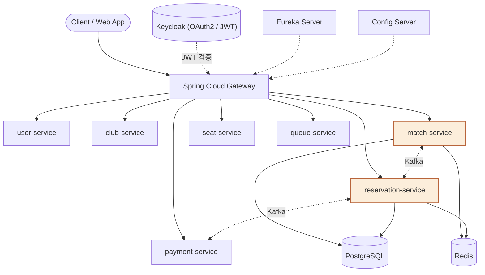
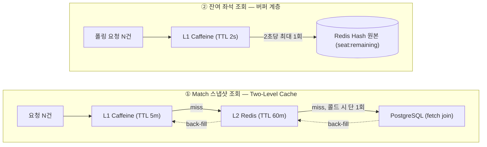

# 🎟️ match-service (3sTICKETING)


> **3sTICKETING** 플랫폼의 핵심 도메인인 **'경기(Match)'** 및 **'구역별 좌석 등급·가격 정책(ZonePolicy)'**을 관리하는 마이크로서비스입니다.

인기 경기 오픈 순간 발생하는 대규모 "선착순 티켓팅" 시나리오를 지원하기 위해 설계되었습니다. 정적이지만 전체 시스템에서 조회 트래픽이 가장 집중되는 경기 데이터를 안정적이고 지연 없이 서빙하는 데 중점을 둡니다.

---

## 📖 Core Domain

* **Match (애그리게이트 루트):** 홈/원정 구단, 경기장, 경기 일시, 티켓 오픈 일시를 관리합니다.
  * **상태 전이:** `DRAFT` → `PENDING_APPROVAL` → `APPROVED` → `OPEN` → `CLOSED` / `CANCELED`
  * 도메인 Enum을 통해 전이 규칙과 정보 수정 가능 시점을 엄격하게 강제합니다.
* **MatchZonePolicy:** 좌석 등급(seatGradeId)별 가격과 총 좌석 수를 관리합니다. 기록 보존을 위해 동일 좌석 등급 정책은 삭제 여부와 무관하게 재등록할 수 없습니다.

---

## 🏗️ Architecture

3sTICKETING은 Eureka(디스커버리) · Config Server(중앙 설정) · Gateway(단일 진입점, Keycloak JWT 검증) 위에서 동작하는 10개 마이크로서비스로 구성되며, match-service는 경기·좌석 등급·가격 정책을 관리하고 Kafka로 reservation-service와 좌석 점유 상태를 동기화합니다.



*주황색 = 담당 서비스(match-service, reservation-service)*

---

## ✨ Key Features & Technical Decisions

### 1. 트랜잭션 최소화 및 Outbox 패턴을 통한 이벤트 발행
* **Two-Bean 패턴 적용:** 경기 생성 시 외부 서비스(club, seat)를 Feign으로 검증합니다. 외부 호출 구간과 DB 쓰기 트랜잭션 구간을 별도의 빈(MatchWriteService)으로 분리하여 DB 커넥션 점유 시간을 최소화했습니다.
* **Transactional Outbox:** 상태 변경(`APPROVED`, `CANCELED`)에 따른 이벤트 발행 시, 도메인 변경과 Outbox 저장을 단일 트랜잭션으로 묶어 데이터 정합성을 보장합니다.

### 2. Two-Level 캐시 아키텍처 (Cache Stampede 차단)
정적 데이터 조회가 집중될 때 발생할 수 있는 캐시 스탬피드(Cache Stampede) 병목을 방지하기 위해 커스텀 TwoLevelCache를 구현했습니다.
* **Caffeine L1 + Redis L2 결합:** `@Cacheable(sync=true)`와 Caffeine `computeIfAbsent`를 활용해, 캐시 미스 시 단일 스레드만 L2 → DB 순으로 통과하도록 게이트(Gate)를 구축했습니다.
* 콜드 스타트나 Redis 장애 시에도 DB 쿼리 폭주를 원천 차단(호출 1회로 수렴)합니다.

### 3. 잔여 좌석 트래픽 흡수 계층 (Buffer)
* 예약 서비스에서 원자적으로 갱신하는 Redis 원본(`seat:remaining:{matchId}`) 앞단에 **Caffeine L1(TTL 2초)**을 흡수 계층으로 배치했습니다.
* 초당 수천 건의 사용자 폴링(Polling) 트래픽이 Redis로 직접 인입되는 것을 차단하고 네트워크 I/O 오버헤드를 극단적으로 낮췄습니다.



`@Cacheable(sync=true)` + Caffeine `computeIfAbsent`로 캐시 미스 시 단일 스레드만 조회를 진행하고 나머지 요청은 결과를 공유받도록 해, 두 흐름 모두에서 Cache Stampede 및 TTL 만료 순간의 mini stampede를 차단합니다.

### 4. 멱등성을 보장하는 좌석 이벤트 소비
* Kafka로 유입되는 예약 확정/취소 이벤트를 소비하여 잔여 좌석 카운터를 갱신합니다.
* Lua 스크립트를 활용해 카운터 연산을 원자적으로 처리(0 미만 하락 방지)하며, `reservationSeatId`를 멱등성 키로 사용하여 At-least-once 재전달에 의한 중복 처리를 방지합니다.

---

## 🌐 API Reference

| Method | Endpoint | Description |
| :--- | :--- | :--- |
| `POST` | `/api/matches` | 경기 생성 |
| `GET` | `/api/matches/{matchId}` | 경기 상세 조회 |
| `GET` | `/api/matches/{matchId}/remaining-seats` | 구역별 잔여 좌석 수 조회 |
| `PUT` | `/api/matches/{matchId}` | 경기 정보 수정 (DRAFT, PENDING_APPROVAL) |
| `PATCH` | `/api/matches/{matchId}/status` | 경기 상태 변경 |
| `DELETE` | `/api/matches/{matchId}` | 경기 소프트 삭제 |
| `POST` | `/api/matches/{matchId}/zone-policies` | 구역 정책 추가 |
| `PUT` | `/api/matches/{matchId}/zone-policies/{policyId}` | 구역 정책(가격) 수정 |
| `DELETE` | `/api/matches/{matchId}/zone-policies/{policyId}` | 구역 정책 삭제 |
| `GET` | `/internal/matches/{matchId}/seat-grades/...` | (내부망 전용) 가격 스냅샷 조회 |

*(내부 API는 API Gateway 계층에서 외부 클라이언트 접근이 차단됩니다.)*

---

## 🚀 Getting Started

Mac 터미널 환경을 기준으로 로컬에서 프로젝트를 빌드하고 실행하는 방법입니다.

### Prerequisites
* Java 17
* Docker (PostgreSQL, Redis, Kafka 컨테이너용)

### Run
```bash
# 1. 인프라 컨테이너 실행 (docker-compose 파일이 있는 경우)
docker-compose up -d

# 2. 프로젝트 빌드 및 실행
./gradlew clean build -x test
./gradlew bootRun
```

---

## 🛠 Troubleshooting

* [Match 스냅샷 TwoLevelCache 설계](https://tpdudznzl.tistory.com/42)
* [잔여 좌석 폴링, Caffeine L1(2초) 흡수 계층 도입을 통한 성능 개선](https://tpdudznzl.tistory.com/40)
